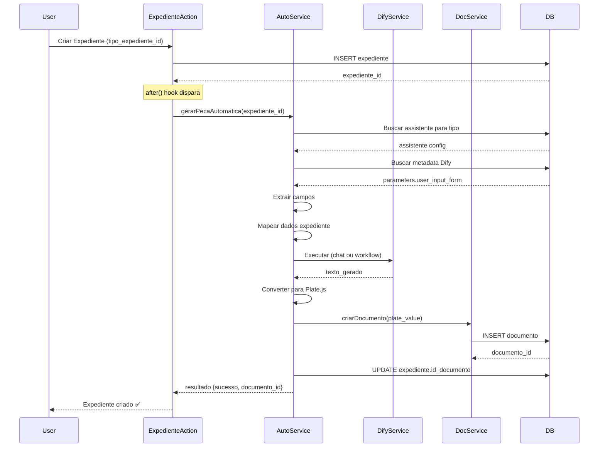

# Assistentes-Tipos Feature

## 📋 Visão Geral

Feature de **geração automática de peças jurídicas** através da integração entre assistentes Dify e tipos de expedientes. Quando um expediente é criado com um tipo configurado, o sistema automaticamente dispara o assistente Dify correspondente para gerar a peça e vinculá-la ao expediente.

## 🎯 Funcionalidades

- **Configuração de Relacionamentos**: Interface para vincular assistentes Dify a tipos de expedientes
- **Geração Automática**: Disparo automático do assistente ao criar expediente
- **Extração de Metadados**: Análise dos parâmetros do Dify (user_input_form)
- **Mapeamento Inteligente**: Mapeamento automático de dados do expediente para inputs do Dify
- **Conversão para Plate.js**: Conversão do texto gerado para formato de documento Plate.js
- **Vinculação Automática**: Documento criado é automaticamente vinculado ao expediente

## 🏗️ Arquitetura

### Estrutura de Arquivos

```
src/features/assistentes-tipos/
├── domain.ts                               # Types, interfaces, Zod schemas
├── repository.ts                           # Database access layer (CRUD)
├── service.ts                              # Business logic layer
├── actions.ts                              # Server actions (Next.js App Router)
├── geracao-automatica-service.ts          # Core automation engine
├── index.ts                                # Barrel exports
└── components/
    ├── assistentes-tipos-config.tsx       # UI configuration component
    └── index.ts

supabase/migrations/
└── 20260218130000_create_assistentes_tipos_expedientes.sql
```

### Camadas

#### 1. **Domain Layer** (`domain.ts`)

Define os tipos e schemas de validação:

- `AssistenteTipo`: Interface base da tabela
- `AssistenteTipoComRelacoes`: Interface com joins (assistente, tipo_expediente, criador)
- Schemas Zod para validação de inputs

#### 2. **Repository Layer** (`repository.ts`)

Acesso ao banco de dados Supabase:

- `buscarPorId()`: Buscar relação por ID
- `buscarPorTipoExpediente()`: Buscar assistente ativo para tipo específico
- `listar()`: Listar com filtros e paginação
- `criar()`: Criar nova relação
- `atualizar()`: Atualizar relação existente
- `deletar()`: Deletar relação
- `ativarRelacao()`: Ativar/desativar relação

#### 3. **Service Layer** (`service.ts`)

Lógica de negócio:

- Validação de inputs com Zod
- Verificação de conflitos (apenas um assistente ativo por tipo)
- Gerenciamento de ativações (desativa outros ao ativar novo)

#### 4. **Actions Layer** (`actions.ts`)

Server actions para comunicação client/server:

- `listarAssistentesTiposAction`
- `buscarAssistenteParaTipoAction`
- `criarAssistenteTipoAction`
- `atualizarAssistenteTipoAction`
- `deletarAssistenteTipoAction`
- `ativarAssistenteTipoAction`
- `gerarPecaAutomaticaAction` ⭐

#### 5. **Automation Engine** (`geracao-automatica-service.ts`)

Motor de automação que executa toda a pipeline:

##### Função Principal: `gerarPecaAutomatica()`

**Pipeline de Execução:**

1. **Buscar Expediente**
   - Carrega dados completos do expediente

2. **Buscar Assistente Configurado**
   - Verifica se existe assistente ativo para o tipo do expediente
   - Retorna se não houver configuração

3. **Carregar Metadados Dify**
   - Busca metadata completo do assistente (parameters.user_input_form)

4. **Extrair Campos do Formulário** (`extrairCamposFormulario()`)
   - Analisa user_input_form para extrair campos esperados
   - Suporta diferentes tipos: text-input, paragraph, select, number

5. **Preparar Dados** (`prepararDadosExpediente()`)
   - Mapeia campos do expediente para inputs do Dify
   - Converte valores conforme tipo esperado

6. **Executar Dify** (Chat ou Workflow)
   - **Chat**: Usa `prepararQueryChat()` para criar prompt
   - **Workflow**: Chama direto com inputs preparados
   - Trata erros de comunicação

7. **Extrair Texto do Resultado**
   - Chat: Extrai da resposta do LLM
   - Workflow: Usa `extrairTextoDeWorkflow()` para navegar outputs

8. **Converter para Plate.js** (`converterTextoParaPlate()`)
   - Transforma texto em estrutura Descendant[]
   - Preserva parágrafos e formatação básica

9. **Criar Documento**
   - Chama `documentosService.criarDocumento()`
   - Salva com título gerado automaticamente

10. **Vincular ao Expediente**
    - Atualiza `id_documento` no expediente
    - Retorna resultado com IDs

**Resultado:**

```typescript
{
  sucesso: true,
  mensagem: "Peça gerada com sucesso",
  documento_id: number,
  expediente_id: number,
  assistente_usado: string
}
```

### Integração com Expedientes

O hook automático foi adicionado em `/src/features/expedientes/actions.ts`:

```typescript
// 🤖 Geração Automática de Peça Hook
if (result.success && rawData.tipoExpedienteId && user) {
  const expedienteId = result.data.id;

  after(async () => {
    try {
      const { gerarPecaAutomatica } =
        await import("@/features/assistentes-tipos/geracao-automatica-service");

      const resultado = await gerarPecaAutomatica(expedienteId, user.id);

      if (resultado.sucesso) {
        console.log(`✅ Peça gerada: documento ${resultado.documento_id}`);
      }
    } catch (error) {
      console.error(`❌ Erro ao gerar peça`, error);
    }
  });
}
```

**Características do Hook:**

- Executa **após** criação do expediente (não bloqueia)
- Só dispara se expediente tiver `tipoExpedienteId`
- Erros não afetam criação do expediente
- Logs para debugging

## 📊 Banco de Dados

### Tabela: `assistentes_tipos_expedientes`

```sql
CREATE TABLE assistentes_tipos_expedientes (
  id SERIAL PRIMARY KEY,
  assistente_id INTEGER NOT NULL REFERENCES assistentes(id) ON DELETE CASCADE,
  tipo_expediente_id INTEGER NOT NULL REFERENCES tipos_expedientes(id) ON DELETE CASCADE,
  ativo BOOLEAN NOT NULL DEFAULT true,
  criado_por INTEGER NOT NULL REFERENCES usuarios(id) ON DELETE RESTRICT,
  created_at TIMESTAMP WITH TIME ZONE DEFAULT CURRENT_TIMESTAMP NOT NULL,
  updated_at TIMESTAMP WITH TIME ZONE DEFAULT CURRENT_TIMESTAMP NOT NULL
);
```

**Índices:**

- `idx_assistentes_tipos_assistente`: `(assistente_id)`
- `idx_assistentes_tipos_tipo_expediente`: `(tipo_expediente_id)`
- `idx_assistentes_tipos_unique_tipo_ativo`: `(tipo_expediente_id) WHERE ativo = true` (UNIQUE)

**Constraints:**

- Apenas um assistente ativo por tipo de expediente (índice unique parcial)
- Foreign keys com cascade/restrict conforme necessário

**RLS Policies:**

- `select_authenticated`: Usuários autenticados podem ler
- `insert_admin_only`: Apenas admin pode criar
- `update_admin_only`: Apenas admin pode atualizar
- `delete_admin_only`: Apenas admin pode deletar

## 🖥️ Interface de Usuário

### Componente: `AssistentesTiposConfig`

**Localização:** `/src/app/(authenticated)/admin/assistentes-tipos/page.tsx`

**Funcionalidades:**

- 📝 Criar nova configuração (Assistente + Tipo)
- 📄 Listar configurações existentes
- ✅ Ativar/desativar configurações
- 🗑️ Deletar configurações
- 🔄 Auto-refresh após ações

**Props:**

```typescript
interface AssistentesTiposConfigProps {
  assistentes: Array<{ id: string; nome: string; tipo: string }>;
  tiposExpedientes: Array<{ id: string; nome: string }>;
}
```

**Estados Visuais:**

- Badge verde "Ativo" para configurações ativas
- Badge cinza "Inativo" para configurações desativadas
- Loading states durante operações
- Mensagens de sucesso/erro

## 🔧 Uso

### 1. Configurar Relacionamento

```typescript
import { criarAssistenteTipoAction } from "@/features/assistentes-tipos";

const result = await criarAssistenteTipoAction({
  assistenteId: 123,
  tipoExpedienteId: 45,
});

if (result.success) {
  console.log("Configuração criada:", result.data);
}
```

### 2. Gerar Peça Manualmente

```typescript
import { gerarPecaAutomatica } from "@/features/assistentes-tipos/geracao-automatica-service";

const resultado = await gerarPecaAutomatica(expedienteId, usuarioId);

if (resultado.sucesso) {
  console.log("Documento criado:", resultado.documento_id);
}
```

### 3. Listar Configurações

```typescript
import { listarAssistentesTiposAction } from "@/features/assistentes-tipos";

const result = await listarAssistentesTiposAction({
  apenasAtivos: true,
  limite: 20,
  offset: 0,
});

if (result.success) {
  const { items, total } = result.data;
  console.log(`${items.length} de ${total} configurações`);
}
```

## 🔍 Fluxo Completo



## 🐛 Debugging

### Logs

O sistema emite logs em cada etapa:

```
🤖 [AUTO-GEN] Verificando geração automática para expediente 123
✅ [AUTO-GEN] Peça gerada automaticamente: documento 456
ℹ️ [AUTO-GEN] Geração não executada: Nenhum assistente configurado
❌ [AUTO-GEN] Erro ao gerar peça para expediente 123: Error message
```

### Verificar Configuração

```sql
SELECT
  ate.*,
  a.nome as assistente_nome,
  te.tipo_expediente as tipo_nome
FROM assistentes_tipos_expedientes ate
JOIN assistentes a ON ate.assistente_id = a.id
JOIN tipos_expedientes te ON ate.tipo_expediente_id = te.id
WHERE ate.ativo = true;
```

### Verificar Metadados Dify

```sql
SELECT
  id,
  nome,
  jsonb_pretty(metadata->'parameters'->'user_input_form') as form_fields
FROM assistentes
WHERE id = 123;
```

## ⚠️ Tratamento de Erros

O sistema é resiliente e não bloqueia criação de expedientes:

1. **Sem Configuração**: Retorna `sucesso: false` com mensagem explicativa
2. **Erro no Dify**: Captura exceção, loga erro, retorna resultado negativo
3. **Erro na Conversão**: Fallback para formato simples de texto
4. **Erro ao Criar Documento**: Propaga erro, expediente já está criado

## 🚀 Melhorias Futuras

- [ ] Suporte a templates complexos com campos dinâmicos
- [ ] Histórico de gerações por expediente
- [ ] Retry automático em caso de falha
- [ ] Preview do documento antes de salvar
- [ ] Suporte a múltiplos documentos por expediente
- [ ] Configuração de timeout por assistente
- [ ] Webhooks de notificação
- [ ] Métricas e analytics de uso

## 📚 Referências

- [Documentação Dify API](https://docs.dify.ai/api)
- [Plate.js Documentation](https://platejs.org/)
- [Supabase Row Level Security](https://supabase.com/docs/guides/auth/row-level-security)
- [Next.js Server Actions](https://nextjs.org/docs/app/building-your-application/data-fetching/server-actions-and-mutations)

---

**Criado em:** 2026-02-18  
**Última atualização:** 2026-02-18  
**Versão:** 1.0.0
